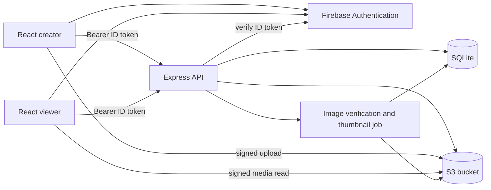

# Architecture and data contract

## Recommended stack

- **Frontend:** React + TypeScript, built with Vite. Two routes share the tour domain model and panorama adapter: creator mode and read-only viewer mode. Firebase Authentication handles sign-in.
- **Panorama renderer:** Photo Sphere Viewer v5 behind `PanoramaAdapter`; see [research](VIEWER_RESEARCH.md). Keep our graph and orientation math independent of its plugin types.
- **Backend:** Express + TypeScript JSON API. Firebase Admin verifies ID tokens, and services enforce tour ownership. Route handlers call domain services; services use a SQLite repository and an S3 storage adapter.
- **Object storage:** private S3 bucket (or S3-compatible service in local development) for original panoramas, plan images, and generated thumbnails. Browsers upload to short-lived signed URLs issued by Express.
- **Database:** SQLite for tours, pages, scenes, placements, connections, link overrides, and media metadata. Enable foreign keys, use migrations and WAL mode, and commit graph changes in transactions.



SQLite is appropriate for an initial single-deployment app with modest simultaneous writes. Its database file must live on persistent storage and be backed up together with the S3 objects. If multiple API instances or high write concurrency become necessary, replace the repository implementation and migrate to a server database; the React app and API shapes should not depend on SQLite details.

## Reusable code boundaries

```text
apps/
  web/
    src/app/                 routes and app shell
    src/auth/                Firebase client, session, and protected routes
    src/features/tours/      tour loading and commands
    src/features/editor/     library, canvas, pages, inspector, panorama editor
    src/features/viewer/     full-screen viewer and thumbnail tray
  api/
    src/auth/                Firebase Admin verification and owner checks
    src/routes/              HTTP parsing and response mapping
    src/services/            tour, graph, media, and manifest rules
    src/repositories/        SQLite queries and migrations
    src/storage/             S3 signing and object verification
    src/jobs/                image validation and thumbnails
packages/
  domain/                    shared types, validation shapes, bearing math
  panorama/                  PSV adapter and React lifecycle wrapper
  ui/                        local theme tokens and shared controls
Documentation/
```

The editor canvas owns page transforms, selection, dragging, and graph visuals. The panorama adapter owns only rendering and direction conversion. The backend service layer enforces graph invariants and access control; the frontend may mirror them for immediate feedback but cannot be the sole validator. See the [authentication contract](AUTH.md).

## Domain model

| Record | Main fields | Rules |
| --- | --- | --- |
| `tours` | `id`, `owner_uid`, `title`, `entry_scene_id?`, `default_north_yaw_deg`, `version`, timestamps | `owner_uid` is the verified Firebase UID. One tour owns all pages and scenes. `default_north_yaw_deg` is the photo-local yaw where north appears under the shared capture assumption. The entry scene must belong to the tour. |
| `media_assets` | `id`, `tour_id`, `kind` (`panorama`/`plan`), `object_key`, `thumbnail_key?`, MIME, dimensions, byte size, `status`, timestamps | Object keys are generated by the server. Only ready panoramas become viewable scenes. |
| `scenes` | `id`, `tour_id`, `panorama_asset_id`, `name`, `sort_order`, `north_yaw_override_deg?` | Exactly one scene per ready panorama asset. The optional override has the same photo-local meaning as the tour default. Every scene is in the viewer tray, with or without a placement. |
| `pages` | `id`, `tour_id`, `name`, `sort_order`, `north_angle_deg`, `plan_asset_id?`, plan transform | Any number of pages; the plan image is optional. North defaults to page up. |
| `placements` | `id`, `tour_id`, `page_id`, `scene_id`, `x`, `y` | A scene has at most one placement in the initial build. Coordinates are in stable logical page units, independent of pan/zoom and image pixels. |
| `plan_connections` | `id`, `tour_id`, `placement_a_id`, `placement_b_id` | Unordered relationship between two placements. Same-page connections draw a solid line; cross-page ones draw portal indicators. |
| `navigation_links` | `id`, `tour_id`, `source_scene_id`, `target_scene_id`, `plan_connection_id?`, `position_mode` (`auto`/`manual`), `manual_yaw_deg?`, `manual_pitch_deg?` | Directed hotspot. `plan_connection_id = null` means it was created in the panorama viewer and has no full canvas connection. |

Constraints enforced by services and database migrations:

- Each referenced page, asset, scene, and placement belongs to the same tour. A link cannot target its own source scene.
- At most one navigation link exists for a given directed source/target pair in the first build. This makes link selection and PSV node mapping unambiguous.
- A same-page plan connection creates or reuses two directed links. Existing custom positions are preserved when attaching a viewer-created link to a new plan connection. The two link positions can diverge afterward.
- `auto` is valid only for a link owned by a same-page plan connection. Its manual yaw/pitch fields are null. `manual` requires both angles. Cross-page and unplaced-scene links are manual.
- Removing a placement deletes its plan connections and the links belonging to those connections. Independent links with `plan_connection_id = null` remain. Removing a scene deletes its placement and every link to or from that scene.
- Do not rely on database cascading alone for user-visible delete behavior; return a preview/count for confirmation and perform the final mutation transactionally.

If a creator removes one direction of a plan connection, retain the connection and show its remaining direction on the canvas. Removing the connection itself removes its attached link directions. This supports one-way navigation without changing the two-way default.

## Coordinate and orientation rules

Store page positions in a stable logical page coordinate system, for example a 1000 × 1000 plane with `x` increasing right and `y` increasing down. The plan image has its own placement/scale/rotation transform on that plane; panning or zooming the editor changes only the viewport transform. Replacing the plan image therefore does not move nodes.

For two placements on the same page:

```text
dx = target.x - source.x
dy = target.y - source.y
canvasBearingDeg = atan2(dx, -dy) × 180 / π   // clockwise from page up
headingDeg = normalize360(canvasBearingDeg - page.northAngleDeg)
autoPitchDeg = 0
```

The reverse link uses the bearing from the other node, so its heading differs by 180°. A zero-length connection is invalid because its direction is undefined. `northAngleDeg` is the clockwise angle from page up to the north arrow. Thus a target directly right is east only when north points up.

The panorama adapter maps this domain heading to PSV yaw. After tour or scene orientation calibration, viewer yaw 0 represents north; then heading 0/90/180/270 maps to north/east/south/west. The tour-level calibration covers the initial shared-camera-direction assumption; an optional per-scene override handles images with different seams or metadata. PSV can apply [sphere correction and pose metadata](https://photo-sphere-viewer.js.org/guide/config), and its [compass documents north at yaw 0](https://photo-sphere-viewer.js.org/plugins/compass.html). Verify the sign and correction order with four cardinal fixtures before shipping; do not scatter sign flips across components.

Store manually adjusted yaw/pitch in **photo-local spherical coordinates** (`yaw` normalized modulo 360, `pitch` from -90 to +90). The adapter converts between these and PSV's corrected viewer coordinates. This keeps a custom hotspot attached to the same part of a photo if north calibration changes. An auto link resolves its direction from current placements whenever the graph is read or mutated. A manual link resolves solely from its saved angles, so moving nodes never overwrites it. “Reset to plan” switches a same-page, placed link back to `auto` and clears the manual fields.

## API outline

All endpoints below are under `/api`. Every endpoint requires a verified Firebase ID token and server-side tour-owner check, except creation and listing, which use the verified UID directly. Request and response shapes live in `packages/domain` and are validated on the server. IDs in route paths are scoped to the tour. Use atomic commands for connection creation/deletion because they affect multiple link rows.

| Endpoint | Purpose |
| --- | --- |
| `GET /tours` | List tours whose `owner_uid` matches the verified Firebase UID. |
| `POST /tours`, `GET /tours/:id`, `PATCH /tours/:id` | Create/load/edit a tour, including entry scene and orientation calibration. `GET` returns an editor aggregate. |
| `POST /tours/:id/uploads` | Reserve an asset and return a short-lived signed S3 upload URL. |
| `POST /tours/:id/uploads/:assetId/complete` | Verify the object exists, enqueue validation/thumbnail work, and return processing state. |
| `POST /tours/:id/pages`, `PATCH /tours/:id/pages/:pageId`, `DELETE /tours/:id/pages/:pageId` | Manage floors, north direction, and optional plan image. |
| `PATCH /tours/:id/scenes/:sceneId`, `DELETE /tours/:id/scenes/:sceneId` | Rename/reorder or explicitly delete a photo scene. |
| `POST /tours/:id/placements`, `PATCH /tours/:id/placements/:id`, `DELETE /tours/:id/placements/:id` | Place, move, or unplace a scene. |
| `POST /tours/:id/connections`, `DELETE /tours/:id/connections/:id` | Create/remove a plan connection and its directed links transactionally. |
| `POST /tours/:id/links`, `PATCH /tours/:id/links/:id`, `DELETE /tours/:id/links/:id` | Create a viewer-origin link; set/reset a custom angle; remove a single direction. |
| `GET /tours/:id/viewer-manifest` | Read-only scenes, resolved links, page labels, thumbnails, entry scene, and short-lived media URLs. |

The viewer manifest includes every **ready** scene, ordered by placed page/scene order and then unplaced upload order. Each link is emitted with a resolved `{ yaw, pitch }` and destination scene ID. The browser sends no S3 credentials to the API. Signed GET URLs have an expiry in the manifest; refresh them before they expire during a long viewing session. Configure S3 CORS for the frontend origin so WebGL can load textures. Treat creator-supplied names as plain text; sanitize any content passed to a PSV caption or tooltip that accepts HTML, as its [configuration guide warns](https://photo-sphere-viewer.js.org/guide/config).

The first build can have one editor at a time. Include a tour `version` with editor mutations so stale writes return a conflict instead of silently overwriting another session. The app can then refetch and show a conflict state.

## Upload and media lifecycle

1. Express checks the requested kind, declared MIME type, and size against configured limits, creates a random object key, and signs a short-lived PUT URL. The original goes directly from browser to S3.
2. The browser calls `complete`. A backend job checks the stored object's actual type and dimensions, verifies that panorama input is supported, creates a thumbnail, and marks the asset ready or failed. A ready panorama creates its scene. Persist the processing state in SQLite so a restarted worker can resume or retry incomplete items.
3. The library polls or subscribes to status. It offers retry or removal for failures. Do not serve a pending panorama in the viewer manifest.
4. The API signs read URLs for originals and thumbnails. Deleting a scene removes its database graph relationships first and schedules object cleanup after commit; failed cleanup can be retried without corrupting the graph.

Start with conventional full-sphere equirectangular still photos (roughly 2:1) and raster plan images. Camera metadata can affect crop and heading, so preserve original metadata and test representative exports. Later, a tiling pipeline can be added behind the media adapter for very large panoramas; PSV has an [equirectangular tiles adapter](https://photo-sphere-viewer.js.org/guide/adapters/equirectangular-tiles.html).

## Access and deployment boundary

Firebase Authentication is the chosen identity provider. Both creator mode and the initial read-only viewer mode require the owner to sign in. Express verifies the Firebase ID token, uses its UID to authorize every tour and media operation, and assigns `owner_uid` on tour creation. The client does not choose the owner. Public share links can later authorize only the viewer manifest and media reads, never editor mutations. Avoid making the S3 bucket public by default. See [authentication and tour access](AUTH.md) for flows and checks.

Deploy the React build as static assets and Express as a persistent service with a durable SQLite volume. Store Firebase Admin and S3 credentials only on the API. Back up SQLite consistently and retain S3 media with a matching retention policy. Log upload failures and manifest errors with tour/asset IDs rather than tokens, media URLs, or credentials.
